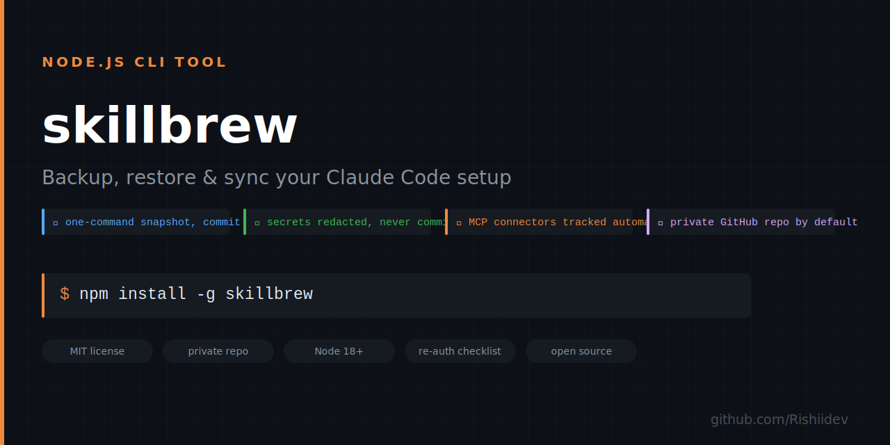

# ⚡ skillbrew — never lose your Claude Code setup again

<div align="center">
  
  <br/><br/>

**One command backs up your entire Claude Code setup — skills, plugins, agents, and MCP connectors — and rebuilds it on a fresh machine with a second command.**

[](https://github.com/Rishiidev/skillbrew/stargazers)
[](https://github.com/Rishiidev/skillbrew/actions)
[](LICENSE)
[](https://github.com/Rishiidev/skillbrew/releases)

*Works in Claude Code · Claude Desktop · claude.ai*

</div>

> One command backs up your entire Claude Code setup — skills, plugins, agents, and MCP connectors — and rebuilds it on a fresh machine with a second command.

---

## The Problem

A machine reset or laptop switch wipes `~/.claude` — every custom skill, agent, plugin install, and MCP connector config has to be rebuilt by hand from memory, one `npm install` and re-auth at a time. There's no record of what was even installed, so half the setup is quietly lost.

## The Fix

`skillbrew snapshot` commits and pushes your skills, agents, plugin list, and sanitized MCP connectors to a private GitHub repo you own. On a new machine, `skillbrew restore` rebuilds `~/.claude`, reinstalls plugins, and prints an exact re-auth checklist — nothing is ever overwritten without a timestamped backup first.

```bash
skillbrew init --github     # create YOUR OWN private backup repo
skillbrew snapshot          # save everything, commit, push
# ...machine reset happens...
skillbrew restore           # rebuild ~/.claude, reinstall plugins, print re-auth checklist
```

---

## Install

| Platform | Command |
|----------|---------|
| **npm** | `npm install -g skillbrew` |
| **npx (no install)** | `npx skillbrew init --github` |
| **Claude Code / Desktop** | `git clone https://github.com/Rishiidev/skillbrew` then run via `node` |
| **claude.ai** | Download [`skillbrew.skill`](../../releases/latest) → Settings → Capabilities → import |

---

<div align="center">
<b>Backs up skills, plugins, agents and MCP connectors across 4 platforms. Star it — 2 seconds.</b><br>
<a href="https://github.com/Rishiidev/skillbrew">⭐ Star on GitHub</a>
</div>

---

## Fresh machine (nothing installed yet)

Paste into a fresh Claude Code session:

> Clone https://github.com/Rishiidev/skillbrew and my backup repo `<your-backup-repo-url>`, then run `SKILLBREW_REPO=<backup-clone> node skillbrew/bin/skillbrew.js restore` and walk me through the re-auth checklist.

The agent is the installer. Swap in whatever repo `skillbrew init --github` created for you — it's yours, not a shared one.

## Commands

| Command | Does |
|---|---|
| `skillbrew init [dir] [--github]` | Create backup repo (default `~/skillbrew-backup`), `--github` adds private remote via `gh` |
| `skillbrew snapshot` | Copy skills/agents/config, record plugins + marketplaces + MCP connectors, commit + push |
| `skillbrew restore [--pack <name>]` | Rebuild `~/.claude`. Current state copied to `~/.claude.pre-restore-<ts>` first — never destructive |
| `skillbrew pack create <name> <skill...>` | Named skill collection |
| `skillbrew pack list` / `pack install <name>` | Show / install a collection |
| `skillbrew export --chat [--pack p]` | Per-skill zips for claude.ai → Settings → Capabilities upload |
| `skillbrew install <github:user/repo\|url\|path> [--pack p] [--force]` | Install skills from any skillbrew-format repo |
| `skillbrew list` | Everything tracked, with platform badges |

## What travels where (honest tiers)

| Item | Claude Code/Desktop | claude.ai | Gemini CLI/Cursor | ChatGPT |
|---|---|---|---|---|
| Skill | ✅ auto | 🟡 zip upload | 🟡 lossy convert (v2) | 🟡 paste text |
| Plugin | ✅ auto (reinstalled from marketplace source) | — | — | — |
| Connector (MCP) | ✅ | ✅ remote | ✅ MCP standard | 🟡 partial |

## Security

- Secrets (env values, MCP tokens/headers) are **redacted** in the repo and kept in `secrets.local.json` (gitignored). Restore merges them back if the file exists, otherwise prints exactly what needs re-keying.
- OAuth sessions can't be copied — restore prints a re-auth checklist.
- Backup repo is created **private** by default.
- `skillbrew install <github:repo>` clones and copies an arbitrary source's skills into `~/.claude/skills` — only install from sources you trust. See [SECURITY.md](SECURITY.md).

## Design notes

- Plugins are recorded as `name@marketplace` + source URL and reinstalled via `claude plugin` — never cache-copied, so versions stay clean.
- Nested `.git` dirs are stripped from skill copies; the origin remote is recorded as `source` (so a picker/marketplace can link back to the original repo).
- `node_modules` never backed up; restore prints an `npm install` note per affected skill.
- Env overrides `SKILLBREW_CLAUDE_HOME` / `SKILLBREW_CLAUDE_JSON` / `SKILLBREW_REPO` / `SKILLBREW_CONFIG` let tests run against a fake home; `claude` CLI calls are skipped in that mode.

## Contributing

See [CONTRIBUTING.md](CONTRIBUTING.md).

## Star History

[](https://star-history.com/#Rishiidev/skillbrew&Date)

---

MIT License · [Rishiidev](https://github.com/Rishiidev)

---

<div align="center">
<b>Found skillbrew useful? A ⭐ helps others find it.</b><br>
<a href="https://github.com/Rishiidev/skillbrew">⭐ Star this repo</a>
</div>
